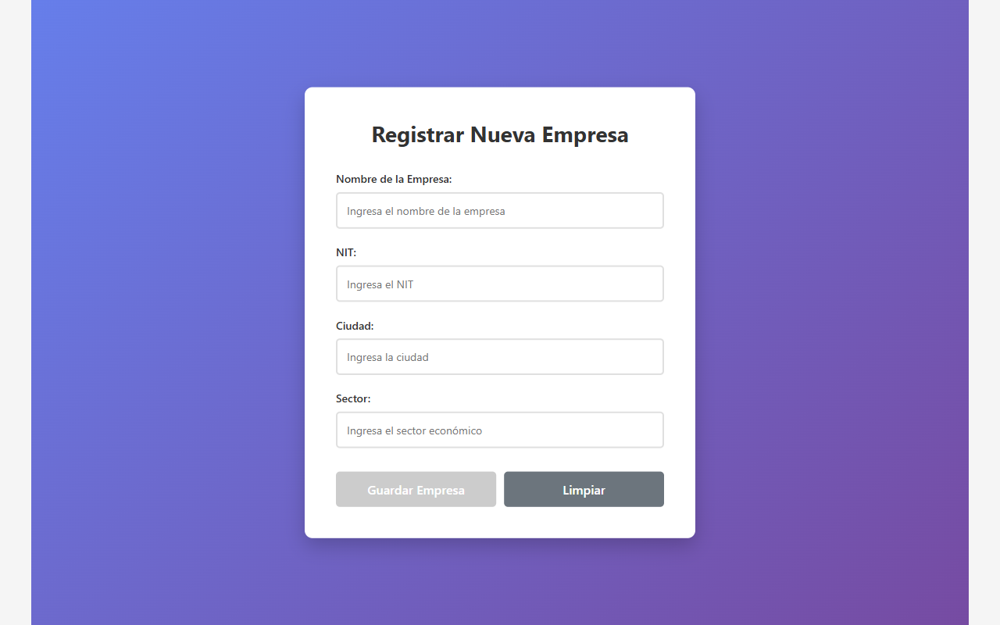
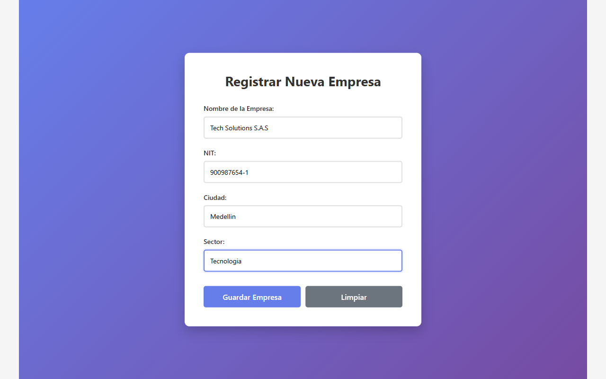
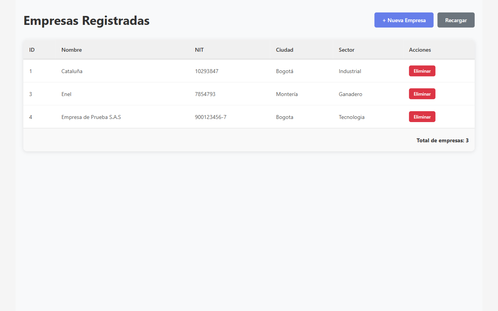

# Frontend — Sistema de Gestión de Empresas y Empleados

Aplicación web desarrollada en **Angular 21** que consume una API REST en Spring Boot para gestionar empresas. Implementa el módulo de Empresa con formulario de inserción y tabla de consulta, conectado al backend mediante `HttpClient`.

---

## Tecnologías

| Tecnología | Versión |
|---|---|
| Angular | 21.2.x |
| TypeScript | 5.9.x |
| RxJS | 7.8.x |
| Angular SSR | 21.2.x |

---

## Estructura del proyecto

```
src/app/
├── components/
│   ├── empresa-form/        # Formulario de inserción de empresa
│   └── empresa-list/        # Tabla de listado de empresas
├── models/
│   └── empresa.model.ts     # Interfaz Empresa
├── services/
│   └── empresa.service.ts   # Servicio HTTP hacia el backend
├── app.config.ts            # Configuración global (HttpClient, Router)
└── app.routes.ts            # Rutas: /lista y /crear
```

---

## Modelo de datos — Empresa

| Campo | Tipo | Restricción |
|---|---|---|
| id | number | PK, autogenerado |
| nombre | string | Obligatorio |
| nit | string | Obligatorio |
| ciudad | string | Obligatorio |
| sector | string | Obligatorio |

---

## Conexión con el backend

El servicio apunta al endpoint del backend Spring Boot:

```typescript
// src/app/services/empresa.service.ts
private apiUrl = 'http://localhost:8080/api/empresas';
```

El backend debe tener CORS habilitado para el origen del frontend:

```java
@CrossOrigin(origins = "http://localhost:60571")
@RestController
@RequestMapping("/api/empresas")
public class EmpresaController { ... }
```

---

## Cómo ejecutar

**Requisito:** Backend Spring Boot corriendo en `http://localhost:8080`

```bash
npm install
npm start
```

La aplicación queda disponible en: `http://localhost:60571`

---

## Rutas disponibles

| Ruta | Componente | Descripción |
|---|---|---|
| `/lista` | EmpresaListComponent | Tabla con todas las empresas |
| `/crear` | EmpresaFormComponent | Formulario para registrar empresa |
| `/` | — | Redirige a `/lista` |

---

## Evidencia de funcionamiento

### 1. Formulario de inserción vacío

Formulario con los 4 campos requeridos: Nombre, NIT, Ciudad y Sector. El botón "Guardar Empresa" permanece deshabilitado hasta que todos los campos sean válidos.



---

### 2. Formulario con datos ingresados

Al completar todos los campos, el botón "Guardar Empresa" se habilita y consume el endpoint `POST /api/empresas` del backend.



---

### 3. Tabla consultando datos desde el backend

La tabla consume el endpoint `GET /api/empresas` y muestra todas las empresas registradas. Presenta las columnas ID, Nombre, NIT, Ciudad y Sector.



---

## Validaciones del formulario

- Todos los campos son obligatorios (`Validators.required`)
- Nombre, Ciudad y Sector requieren mínimo 3 caracteres
- NIT requiere mínimo 5 caracteres
- Mensajes de error se muestran al tocar cada campo inválido
- El botón de envío se deshabilita si el formulario es inválido

---

## Flujo de inserción

```
Usuario llena el formulario
        ↓
Clic en "Guardar Empresa"
        ↓
POST http://localhost:8080/api/empresas
        ↓
Respuesta 200 OK del backend
        ↓
Redirección automática a /lista
        ↓
GET http://localhost:8080/api/empresas
        ↓
Tabla actualizada con la nueva empresa
```

---

## Endpoints consumidos

| Método | Endpoint | Uso |
|---|---|---|
| GET | `/api/empresas` | Listar todas las empresas |
| POST | `/api/empresas` | Crear una nueva empresa |

> Según el enunciado, no se implementa formulario ni tabla para la entidad hija **Empleado**.
